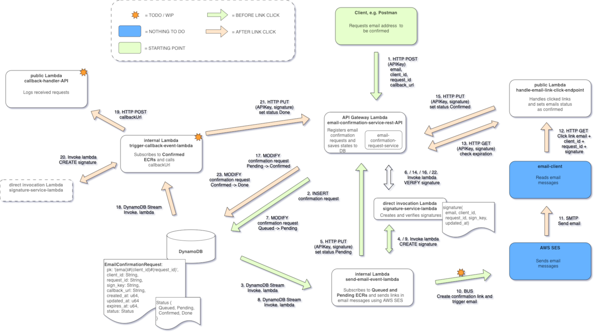

# email-confirmation-service
This is a project for practicing using rust and aws-cdk to create aws lambdas. 

## Descrition of the application
The main concept is that a client can request this service to confirm authenticity of an email address. 
After a request is made the service creates a link that is sent to the email using AWS SES. 
When recipient clicks the link the address is confirmed and a POST is made to the requested callback url. 
The link is protected with a signature that is created using information that is never sent outside 
the service and it expires in 60 minutes. (The lifetime could be an environment variable too)

This project uses different ways to invoke lambdas: API Gateway, direct invocation DynamoDB streams (and probably SNS or SQS). 

The project was started by following [this tutorial](https://blog.stackademic.com/rust-apigateway-lambda-dynamo-cdk-another-all-in-one-serverless-backend-option-4da2059a8810)

## Architecture


## Prerequisites
- aws-cdk
- aws account

## Technologies
- Rust
- Cargo-Lambda
- Axum
- Dynamo
- API Gateway
- AWS SES

## Security
- The service is not production ready, only PUT and POST end points are protected with API keys.
- The internal and external APIs should probably be separate lambdas, behind separate API Gateway.
- The service is almost multi-tenant, but at the moment, if you have an API key, you can change data of all clients.
- Signatures are created and validated using data that never leaves backend, but it could be even better to have that data in a completely separate table.
- To enable sending emails through AWS SES you need to verify sender address or domain at AWS SES Identities.
- Domain verification requires changing the domain's DNS settings.

## Environment variables to be set
See [setup-environment-template.sh](setup-environment-template.sh).
Some rows are duplicates. The environment variables are listed per lambda.
Things just won't work without them but you won't know all of them before 
you have deployed the services first.

### EmailConfirmationLambdaFunction

EMAIL_CONFIRMATION_REQUEST_SERVICE_DYNAMO_TABLE_NAME
: Table name to be used in storing email confirmation requests and traceing their status'

SIGNATURE_SERVICE_LAMBDA_FUNCTION_NAME
: Name of the lambda function used to create and validate signatures 

```
Note: In addition to the environment variables the API keys for external use have to be configured.
```

### HandleEmailLinkClickLambdaFunction

EMAIL_CONFIRMATION_REQUEST_SERVICE_URL
: Public URL of the email confirmation service's API Gateway endpoint

EMAIL_CONFIRMATION_REQUEST_SERVICE_INTERNAL_API_KEY
: API key to be used in internal communication. (Configured at API Gateway of EmailConfirmationLambdaFunction.)

### SendEmailEventLambdaFunction

EMAIL_CONFIRMATION_DYNAMODB_STREAM_ARN
: ARN of the DynamoDB stream related to the table used (EMAIL_CONFIRMATION_REQUEST_SERVICE_DYNAMO_TABLE_NAME)

SIGNATURE_SERVICE_LAMBDA_FUNCTION_NAME
: Function name of the SignatureServiceLambdaFunction

EMAIL_LINK_CLICK_HANDLER_SERVICE_URL
: Public URL of the link click handler service's API Gateway endpoint

EMAIL_CONFIRMATION_REQUEST_SERVICE_URL
: Public URL of the email confirmation service's API Gateway endpoint

EMAIL_CONFIRMATION_REQUEST_SERVICE_INTERNAL_API_KEY
: API key to be used in internal communication. (Configured at API Gateway of EmailConfirmationLambdaFunction.)

EMAIL_SENDER_ADDRESS
: Email address to be used as the sender. (Needs to be verified.)

### SignatureServiceLambdaFunction
EMAIL_CONFIRMATION_SERVICE_LAMBDA_ARN
: ARN of the EmailConfirmationLambdaFunction

EMAIL_SENDING_LAMBDA_ARN
: ARN of the SendEmailEventLambdaFunction

### TriggerCallbackEventLambdaFunction
EMAIL_CONFIRMATION_DYNAMODB_STREAM_ARN
: ARN of the DynamoDB stream related to the table used (EMAIL_CONFIRMATION_REQUEST_SERVICE_DYNAMO_TABLE_NAME)

SIGNATURE_SERVICE_LAMBDA_FUNCTION_NAME
: Function name of the SignatureServiceLambdaFunction

## Set up API keys
Create API keys in AWS. 
- One is needed for email-link-click-handler to call email-confirmation-request-service.
- Another one is needed for client for posting new email-confirmation-requests

API-key is sent to API Gateway in x-api-key header of the request.

## Service startup
    . setup-environment.sh 
    for each subapplication:
        cd subapplication/cdk
        cdk deploy

## Service usage
...


## Testing

### Unit tests

### Local testing

### API testing
- use e.g. [Postman](https://www.postman.com)

